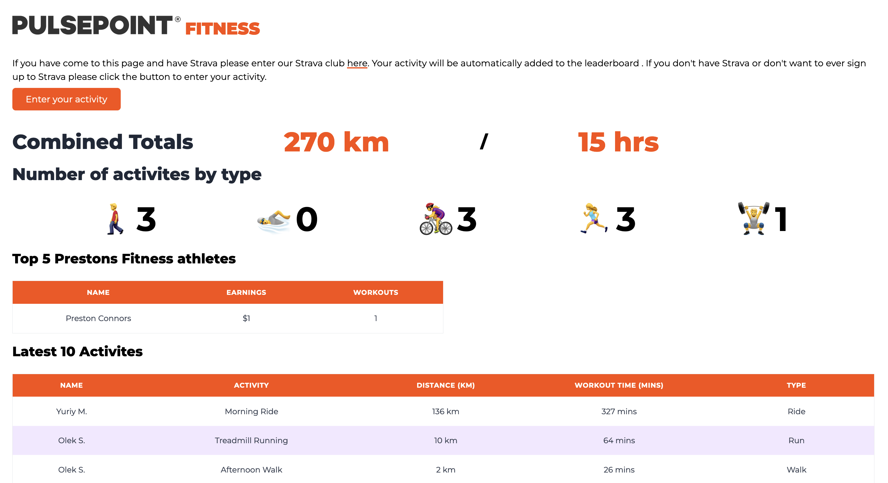

# Pulsepoint Fitness Club

This simple web ui displays data taken from the PulsePoint's Strava club page
via the [Strava API](https://developers.strava.com/docs/reference/). So it can
be displayed in a leader board type fashion.

We total up the number of activities and track the total kilometres and hrs of
the athletes to help spur people on. There is also a hidden form that allows
users to input their activities if they're not on Strava.

All this goes into a [Supabase](https://supabase.com/) powered back end.
Allowing myself and others to query the tables to generate data around the
activities incase we're running any company wide competitions.

The script that pulls the data from the Strava API is a python script that
pushes the data into the supabase table and compares it on the following request
not to duplicate data. This runs daily via Kubernetes and Cron at midnight EST,
allowing us to get the latest Strava data.
